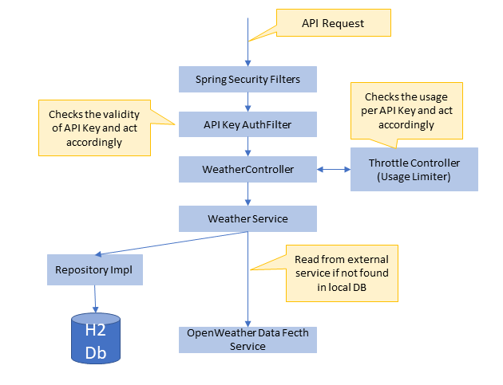

# Weather API Service Application

## Design and Implementation

1. The API was built following the HTTP request / response guidelines. The proper HTTP status codes were used to indicate the status of the action.
2. The APIs were implemented following the RESTful API guidelines.
3. Spring framework used to follow the best practices and guidelines.
4. The API Key enforcement algorithm uses proper Spring Security guidelines
5. The request parameters were validated before accepting any actions. If there are failures, throws sufficient error messages.

## Design Considerations
1. Due to the extreme time limit, I have not expired the already stored data records. Ideally, they should expire and read from the external services after a given time out.
2. The OpenWeatherMaps API key should be loaded from an environment file at the runtime than hard coded to the application.

## How to Run
1.	Extract the zip archive to a folder.
2.	Go inside the folder and run *mvn package*
3.	Once its successfully built, run the application using  *mvnw spring-boot:run*

## How to Test
1. Open a web browser and try following urls.
   1. `http://localhost:8080/api/weather/<CountryCode>/<City>?apiKey=<ApiKey>` 
   http://localhost:8080/api/weather/AU/Melbourne?apiKey=jvlDbMHNkGHplYpquIvAphrxIdreDPrm

